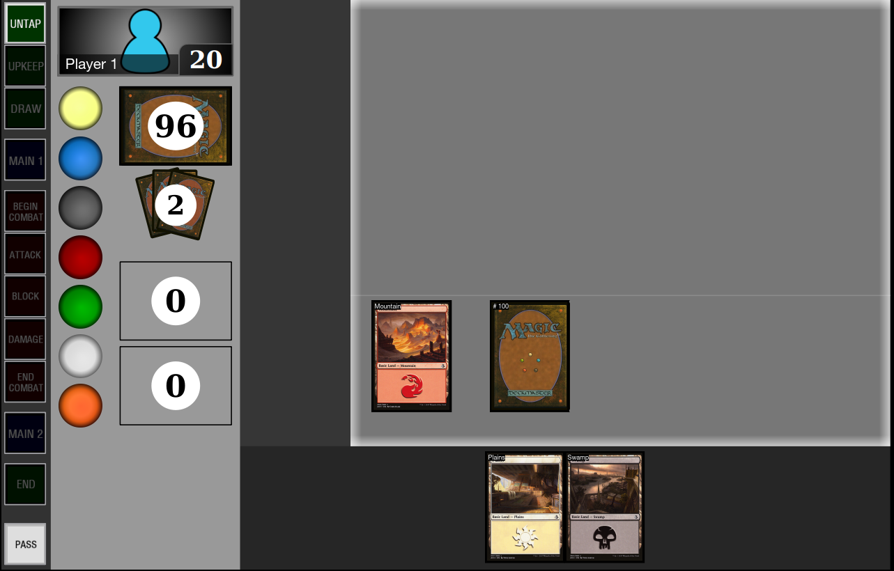
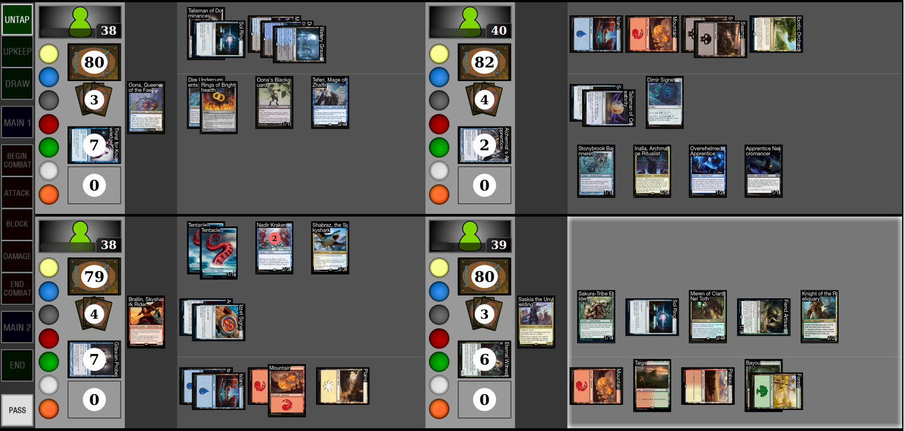
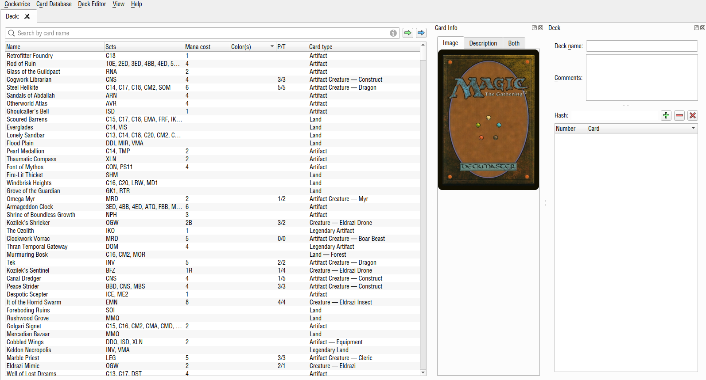

## Modern Theme for Cockatrice

Put the files in the location specified here: https://github.com/Cockatrice/Cockatrice/wiki/Themes#what-is-a-theme

This theme uses `helvetica_condensed.ttf` that is found in `themes/modern/helvetica_condensed.ttf` and needs to be installed.

If you don't want to install the `helvetica_condensed.ttf`, then just delete the style.css file or comment out the style for the font.

The sound theme is technically separate from the UI theme, which is optional

You'll have to re-start cockatrice after switching to get the icons to load correctly.
